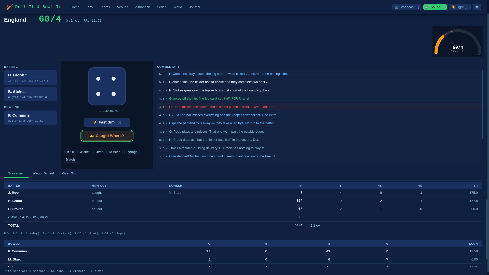
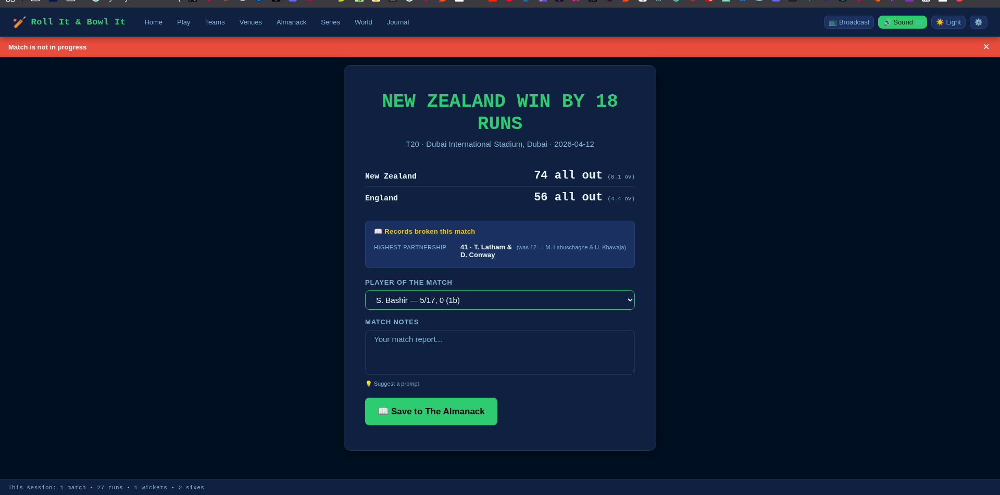
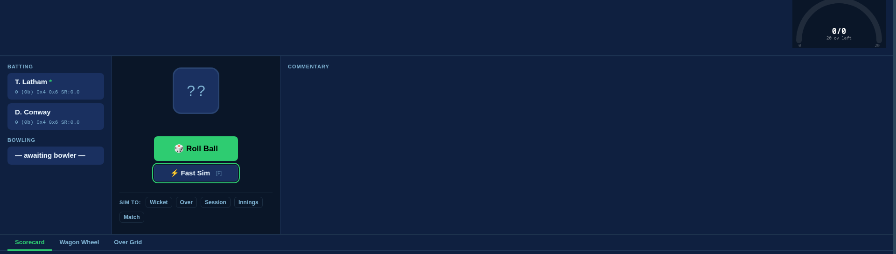
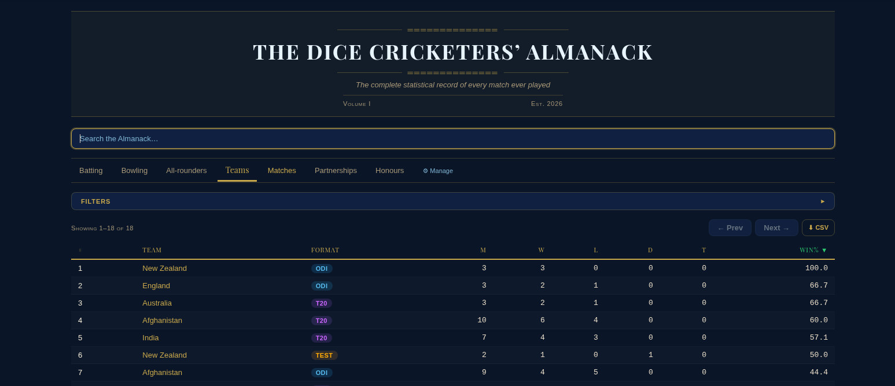
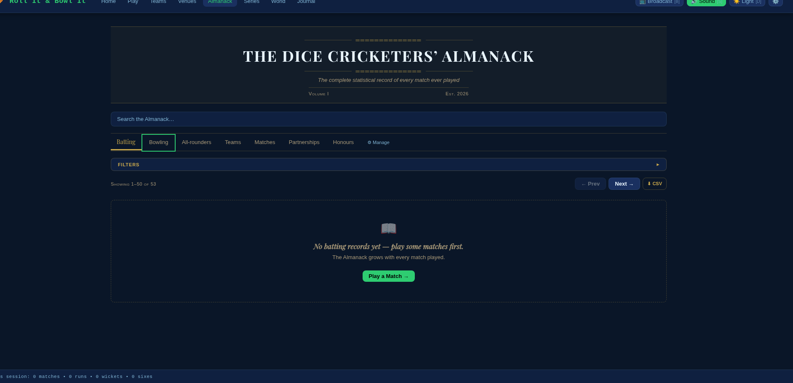
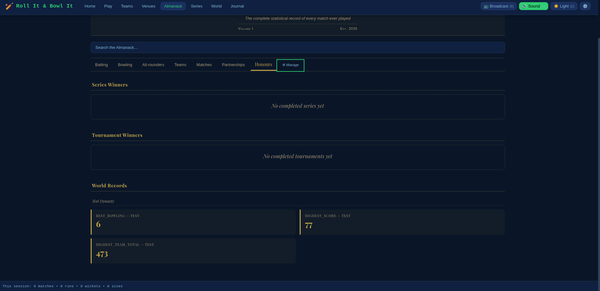
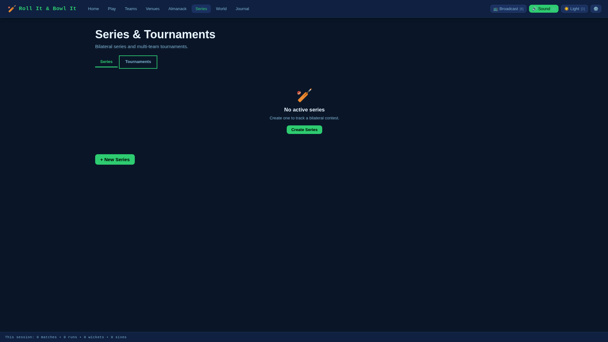

# Roll It & Bowl It

**Dice Cricket Done Digitally** — a full-featured cricket simulation game powered by physical dice mechanics, running as a local web app on your machine.

I built this because I wanted the tactile tension of dice cricket but with proper scorecards, standings, and a persistent world that keeps ticking over. You get the genuine uncertainty of rolling a die at every critical moment — will the appeal succeed? is the batter out? — wrapped in a match engine that tracks everything a real cricket season needs: run rates, partnerships, maiden overs, milestones, records.

---

## What it does

- **Live match play** with a 4-stage dice system (HOWZAT! Engine) that models deliveries, appeals, dismissal types, and catch locations
- **Two rolling modes**: Auto-Roll resolves all dice instantly; Manual Roll lets you press each stage yourself and feel every appeal
- **Full season simulation**: schedule matches, fast-sim unplayed games, let the AI run whole seasons unattended
- **Ten international teams** (England, Australia, India, Pakistan, New Zealand, South Africa, West Indies, Sri Lanka, Bangladesh, Afghanistan) with rated batters and bowlers
- **Eighteen venues** with home-ground advantages
- **Persistent world**: standings, averages, career records, head-to-head results all update as matches are played
- **Realistic cricket calendar**: FTP-style scheduling with proper home seasons, bilateral tours, and ICC events (Champions Trophy, WTC Final, T20 World Cup) — or random rotation for faster setup
- **Dice Cricketers' Almanack**: full career batting and bowling statistics, partnership records, honours board with real-world benchmark comparisons and progress bars
- **Tension detection**: the game notices when you're in a tight finish or on a century approach and nudges you toward Manual mode for the atmosphere
- **Broadcast mode**: slower animations, dramatic pauses, designed for streaming

---

## The HOWZAT! Engine

Every delivery runs through up to four dice stages:

| Stage | Die roll decides |
|-------|-----------------|
| **Stage 1** | Delivery type — dot, runs (1–6), wide, no-ball, wicket-possible |
| **Stage 2** | Appeal outcome — is the batter out or not? |
| **Stage 3** | Not-out resolution — what actually happened (defended, drove, edged safe…) |
| **Stage 4** | Dismissal type — bowled, caught, lbw, run out, stumped… |
| **Stage 4b** | Catch location — if caught, who took it and where |

Stages 2–4 only trigger when the delivery warrants them. A clean boundary never needs an appeal; a snicked edge to the keeper always does.

### Wicket probability by batter rating

Real rates measured over 5,000 deliveries per rating in automated tests:

| Batter rating | Dismissed per applicable ball |
|--------------|-------------------------------|
| 1 (weakest)  | 27.2% |
| 2            | 21.2% |
| 3            | 16.2% |
| 4            | 11.2% |
| 5 (best)     | 6.2%  |

The threshold mechanic: a rating-5 batter needs the Stage 2 roll to be ≥ 6 to be out; a rating-1 batter is out on ≥ 2. The single die step between each rating accounts for the smooth ~5% gradient.

---

## Quick start

```bash
# Clone and set up
git clone <repo>
cd roll-it-bowl-it
python -m venv .venv
source .venv/bin/activate        # Windows: .venv\Scripts\activate
pip install -r requirements.txt

# Run (development)
python start.py

# Open http://127.0.0.1:5001 in your browser
```

The database is created and seeded automatically on first run. Teams, players, venues, and a full season schedule are generated from `seed_data.py`.

---

## Rolling modes

### Auto-Roll (default)
Every dice stage resolves the moment you click **Roll** (or press Space/R). The die face animates, the result appears, and the ball is immediately recorded. Great for fast play and simming through innings you care less about.

### Manual Roll
Each dice stage waits for you. After Stage 1 triggers an appeal:

1. "HOWZAT!" flashes up — the fielding team appealing
2. You press **Appeal!** to roll Stage 2
3. The die lands — either **NOT OUT** (press Continue) or **OUT** (press Dismissal)
4. If out via caught, you press **Caught Where?** to roll Stage 4b

Switch modes with the toggle in the match header, or press **M** while no ball is in flight. Switching Manual → Auto mid-over queues the change until the current ball completes.

---

## Keyboard shortcuts

| Key | Action |
|-----|--------|
| Space / R | Roll (when idle) |
| A | Appeal (Manual mode, HOWZAT state) |
| C | Continue / Not Out (Manual mode) |
| D | Dismissal (Manual mode, out pending) / Toggle dark mode (otherwise) |
| M | Toggle roll mode (when idle, not AI vs AI) |
| F | Fast-sim current match |

---

## Tension suggestion banner

When the match situation is tense, a banner appears suggesting you switch to Manual mode:

- T20 with ≤ 2 overs left and < 15 runs needed
- Last wicket standing
- Batter on 95+ runs (century approach)
- Required run rate > 12
- Scores tied with ≤ 1 over left

The banner is per-innings — dismiss it and it won't reappear for that innings.

---

## Project layout

```
roll-it-bowl-it/
├── app.py              # Flask app — all API routes
├── game_engine.py      # HOWZAT! dice engine — do not modify
├── database.py         # DB access layer — do not modify
├── cricket_calendar.py # FTP-style calendar engine
├── schema.sql          # SQLite schema (25+ tables)
├── seed_data.py        # Initial teams, players, venues, world records
├── config.py           # Production config
├── config_dev.py       # Development overrides (not packaged)
├── start.py            # Entry point for both dev and packaged exe
├── templates/
│   └── index.html      # Single-page app shell
├── static/
│   ├── app.js          # All client-side logic
│   └── style.css       # Styles + animations
├── tests/
│   ├── test_engine.py          # 5 engine unit tests
│   ├── test_sim_controls.py    # 5 simulation-control tests
│   ├── test_world_sim.py       # 4 world-simulation tests
│   └── test_canon_system.py    # 94 API + system tests
├── uat/
│   ├── test_calendar.py        # 10 calendar engine UAT tests
│   └── run_uat.py              # UAT orchestrator
├── screenshots/        # Application screenshots
└── ribi.spec           # PyInstaller packaging spec
```

---

## Running the tests

```bash
source .venv/bin/activate
pytest tests/ -v
```

All 103 tests pass against the current codebase. The canon system tests exercise all major API routes with a live SQLite database.

### UAT suite (calendar engine)

```bash
python uat/run_uat.py
# or run a suite directly:
python uat/test_calendar.py
```

10 acceptance tests covering: home-season month enforcement, ICC event placement, double-booking prevention, avoid_months respected, India-Pakistan isolation, format ordering, fixture count by density.

---

## Screenshots

### Match in progress — HOWZAT! appeal (dark mode)


### Match result screen


### Match start — batting and bowling panels


### The Dice Cricketers' Almanack — Teams tab


### The Dice Cricketers' Almanack — Batting records


### The Dice Cricketers' Almanack — Honours with real-world benchmarks


### Series & Tournaments


---

## Building a standalone executable

```bash
pip install pyinstaller
pyinstaller ribi.spec
```

The output is `dist/RollItBowlIt` (Linux/Mac) or `dist/RollItBowlIt.exe` (Windows). The development config (`config_dev.py`) is excluded from the build by the spec file.

---

## Formats supported

- **T20** — 20 overs per side
- **ODI** — 50 overs per side
- **Test** — up to 5 days, two innings per side

---

## Version

`0.2.0-dev` — Python 3.14.3, Flask 3.1.3

See [CHANGELOG.md](CHANGELOG.md) for what's in this release.
For how to play, see [HOWTO_PLAY.md](HOWTO_PLAY.md).
For development notes, see [DEVELOPMENT.md](DEVELOPMENT.md).
